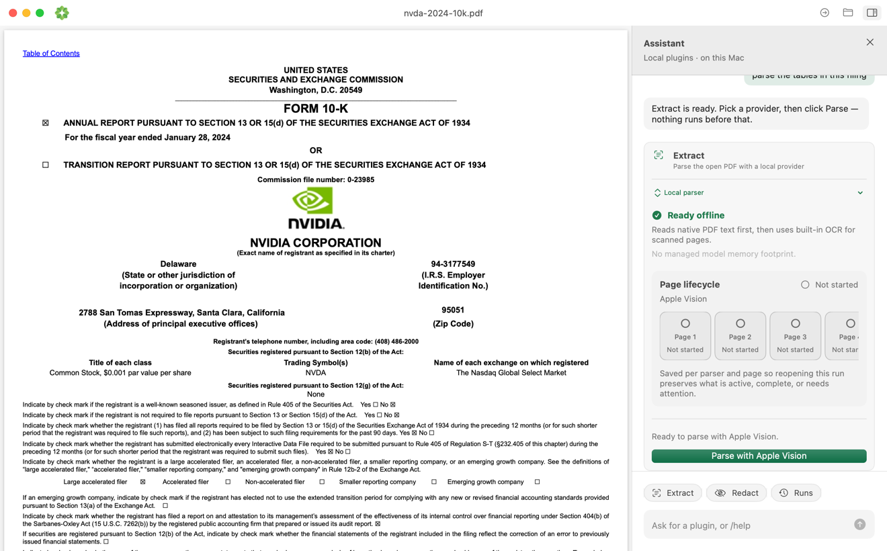

<p align="center">
  
</p>

<h1 align="center">okraPDF for macOS</h1>

<h3 align="center">Read and parse PDFs privately on your Mac</h3>

<p align="center">
  Open a PDF in place, read the original, and choose exactly when to turn it
  into structured local output. No account, document library, or cloud upload.
</p>

> **Source of truth:** this repository is the canonical home of the desktop
> app and owns its CI, releases, signing, and Sparkle updates. It was
> formerly a generated projection of the Okra monorepo; development now
> happens directly here.

RC.12 keeps every marked Unlimited-OCR entity as its own structured block,
even when the model omits source coordinates. Grounded blocks still drive PDF
overlays; the inspector reports how many blocks have no source boxes instead of
silently folding their text into a neighboring region. Parsing remains explicit,
local, and source-preserving.

<p align="center">
  <a href="https://github.com/okrapdf/desktop/releases/tag/desktop-v1.0.0-rc.12">
    
  </a>
  <a href="https://github.com/okrapdf/desktop/releases/tag/windows-v0.1.0-alpha.2">
    
  </a>
  <a href="https://github.com/okrapdf/desktop/releases">
    
  </a>
  <a href="LICENSE">
    
  </a>
</p>

<p align="center">
  <a href="https://github.com/okrapdf/desktop/releases/tag/desktop-v1.0.0-rc.12">Download</a> ·
  <a href="docs/releases/README.md">Release notes</a> ·
  <a href="https://github.com/okrapdf/desktop/issues/new">Report an issue</a>
</p>



## Read first. Parse when you choose.

Opening a document never starts extraction. okraPDF keeps the source PDF where
it is, renders it with native PDFKit, and waits until you choose **Parse**.
The selected local parser then produces reviewable output beside a persistent
per-page run history on this Mac.

- Read text, charts, forms, and scanned pages in a native document-first workspace:
  the PDF stays the main window, with grouped left navigation and a collapsible
  Assistant that uses a deterministic local command router (no cloud model).
- Configure **Extract** and **Redact** under **Plugins**. Browse parse history
  under **Activity → Runs**. Assistant handoffs open one focused destination;
  installation, cancellation, retry, and live progress remain attached to the
  plugin even when navigation is closed.
- Parse with the managed Chandra OCR 2 default on eligible Macs, built-in Apple
  Vision fallback, optional Dots OCR 1.5 or Baidu Unlimited-OCR, or an installed
  Ollama vision model.
- Compare parser/model pairings in the first-run setup guide and use the local
  parser doctor's host-adaptive recommendation without triggering a download.
- Inspect extracted blocks against their source boxes without modifying the PDF.
- Detect PII locally with Presidio, approve source-aligned candidates, and
  export a new raster-burned PDF without changing the source.
- Preview, copy, save, or reveal Markdown and JSON output.
- Cancel and resume long runs without throwing away completed pages.

## Command-line client

Okra.app owns one authenticated, loopback-only `okra.client.v1` host. The
bundled `okra` executable is deliberately thin: it discovers the running app
and sends it commands, so it never starts a second model worker or maintains a
second parse history.

```bash
sudo mkdir -p /usr/local/bin
sudo ln -sf /Applications/Okra.app/Contents/Resources/okra /usr/local/bin/okra

okra status
okra providers
okra chandra invoice.pdf
okra presidio invoice.pdf
```

On a clean eligible Apple-silicon Mac, `okra parse` selects Chandra OCR 2.
Review its model license and complete the one-time setup in **Plugins →
Extract** first. `okra detect` invokes the explicitly configured Presidio
plugin after a positioned parse; it returns candidates but never approves or
exports redactions. The CLI launches or reconnects to Okra.app through
LaunchServices and never reads the app's sandbox container directly.

<table>
  <tr>
    <td width="33%">
      
    </td>
    <td width="33%">
      
    </td>
    <td width="33%">
      
    </td>
  </tr>
  <tr>
    <td align="center">Source-aligned blocks you can inspect</td>
    <td align="center">Readable Markdown, ready to copy or save</td>
    <td align="center">Normalized JSON for downstream workflows</td>
  </tr>
</table>

## Private by design

1. **Your PDF stays put.** okraPDF reads the file you opened instead of copying
   it into an app-owned document library.
2. **Parsing is explicit.** Reading or replacing a document does not create a
   run; extraction starts only when you click **Parse**.
3. **Processing stays local.** Apple Vision, Dots OCR, Chandra OCR 2, and Baidu extraction run
   on the Mac. Ollama uses only its loopback service on this Mac.
4. **Artifacts stay inspectable.** Run state, page checkpoints, Markdown, and
   JSON live in Okra's sandboxed Application Support `Okra/Runs/` directory.
   The latest Presidio candidates live beside a run as `redactions.json`.

Local parser runs accept up to 2,000 PDF pages, cap prepared page images at
4 GB per run, and preserve at least 1 GB of free disk space. Split larger PDFs
before parsing; opening and reading them does not create rendered-page artifacts.

Dots OCR 1.5 is selected by default on an eligible clean install but never
downloads or parses automatically. Hardware eligibility requires Apple silicon,
macOS 14+, at least 16 GB unified memory, and at least 5 GB free disk; an
ineligible Mac falls back to Apple Vision. Completing setup also requires
Python 3.10+. The explicit setup downloads about 3.54 GB, shows the upstream
model terms, and verifies every pinned model artifact with SHA-256. Baidu
Unlimited-OCR remains selectable as an optional legacy parser with its separate
pinned setup. A stored Baidu selection stays on Baidu, and an interrupted Baidu
run resumes only with Baidu. Managed extraction is forced offline after setup.
Apple Vision remains available with no setup, and Ollama remains responsible
for installing and storing Ollama models.

Managed provider setup never discovers Python through `PATH`. It accepts only
Python 3.10+ at the declared `/opt/homebrew/bin`, `/usr/local/bin`, or
Apple `/usr/bin` locations, rejects executable symlinks that leave those roots,
and treats Homebrew installations as user-managed local dependencies.

## Local PII redaction

After a positioned parse finishes, open the **Redact** plugin in the assistant
panel. If Presidio is not ready, its one setup button opens **Plugins →
Redact**; installation never runs inside Assistant. The Redact destination installs
the pinned Microsoft Presidio 2.2.364 and English spaCy 3.8 model under Okra's
sandboxed Application Support `Okra/Providers/presidio` directory, tracks
progress, and supports cancel/retry.
Detection runs through a session-scoped loopback worker and maps each finding
to the complete normalized source block that contains it.

Review and approve every candidate before export. The block-level mapping
intentionally over-redacts rather than risking a partial glyph leak. Export
rasterizes only affected pages at 2x before burning in black boxes, so covered
text is no longer selectable; unaffected pages remain normal PDF pages and the
opened source is never modified.

Optionally enable Presidio's official experimental LangExtract recognizer and
choose an installed Ollama text model. Okra restricts that connection to
`127.0.0.1:11434`; the documented lightweight default is `qwen2.5:1.5b`.
Presidio setup requires Python 3.10 or later. Runs without positioned blocks
must be parsed with a source-aligned provider before redaction is available.

## Local parsers

| Parser | Setup | Best fit |
| --- | --- | --- |
| **Dots OCR 1.5** (dots.mocr) | Eligible-Mac default; explicit pinned 4-bit MLX setup, about 3.54 GB | Structured OCR, reading order, tables, formulas, and source boxes on Apple silicon with macOS 14+, Python 3.10+, and 16 GB+ memory |
| **Chandra OCR 2** (datalab-to) | Optional pinned 8-bit MLX setup, about 5.16 GB | Layout-rich OCR with labeled blocks, tables, forms, math, chemistry, and source boxes on Apple silicon with macOS 14+, Python 3.10+, and 16 GB+ memory |
| **Apple Vision** | None; built into macOS | Zero-setup text and scanned PDFs |
| **Baidu Unlimited-OCR** | Optional legacy pinned 4-bit MLX setup, about 2.4 GB | Existing Baidu workflows, checkpoints, and layout extraction on Apple silicon |
| **Auto (Hybrid)** | Start Ollama and choose an installed vision model | Mixed PDFs; native text with page-level vision fallback |
| **Ollama** | Start Ollama and choose an installed vision model | Bring your own local vision model |

## Download

`desktop-v1.0.0-rc.12` is the current signed public release candidate for
Apple-silicon Macs running macOS 13 or later. RC.12 preserves bbox-less
Unlimited-OCR blocks and reports grounded and ungrounded output counts on top
of RC.11's focused Plugins and Activity navigation.

1. Download `Okra-1.0.0-rc.12.dmg` from the
   [v1.0.0-rc.12 release](https://github.com/okrapdf/desktop/releases/tag/desktop-v1.0.0-rc.12).
2. Optionally download the adjacent checksum and run
   `shasum -a 256 -c Okra-1.0.0-rc.12.dmg.sha256`.
3. Open the DMG, drag **Okra** to **Applications**, and eject the DMG.
4. Open **Okra** from Applications. The app and DMG are Developer ID signed,
   hardened, notarized by Apple, and stapled for normal Gatekeeper opening.

The app checks its signed update feed daily. Choose **Check for Updates…** in
the app menu at any time, or install a newer DMG from
[GitHub Releases](https://github.com/okrapdf/desktop/releases).

## Windows unstable alpha

`windows-v0.1.0-alpha.2` is an unsigned portable build for technical testing
on Windows 10/11. It adds multi-document tabs and split comparison, five page
layouts, thumbnails, outlines, full-document search, selectable text and link
navigation, plus source-preserving annotations with per-document undo/redo and
crash recovery. **Save a Copy** always creates a new PDF.

Download the ZIP and adjacent checksum from the
[Windows alpha.2 prerelease](https://github.com/okrapdf/desktop/releases/tag/windows-v0.1.0-alpha.2).
There is no installer, code signing, or automatic update channel; SmartScreen
may warn on first launch. Treat this build as unstable and keep the original
PDFs available while testing.

## Build from source

You need macOS 13 or later and Swift 5.9 or later.

```bash
git clone https://github.com/okrapdf/desktop.git
cd desktop
swift build
```

To create a local `.app` and DMG:

```bash
./scripts/build-dmg.sh 1.0.0-rc.12
```

Local packages are ad-hoc signed. The release workflow supplies the Developer
ID identity, hardened runtime, notarization, and signed Sparkle appcast.

## Test

```bash
bash scripts/verify-brand-surface.sh
PYTHONDONTWRITEBYTECODE=1 python3 -m unittest discover -s scripts/tests -p '*_tests.py'
swift test
```

The test suite covers the read-before-parse contract, provider integration,
page checkpoints, cancel/resume recovery, structured output, source-box
geometry, Presidio redaction, rasterized export, packaging, and signed-update
metadata.

## Project map

```text
OkraPDF/       SwiftUI app, PDFKit reader, and local parsing providers
Tests/         Product, provider, persistence, and packaging tests
scripts/       Verification, packaging, and release automation
docs/releases/ Versioned user-facing release notes
windows/       Go/WebView2 Windows alpha, React/PDF.js UI, and tests
```

Maintainers should start with [CLAUDE.md](CLAUDE.md),
[RELEASE_CHECKLIST.md](RELEASE_CHECKLIST.md), and
[LAUNCH.md](LAUNCH.md). Historical changes are indexed in
[docs/releases](docs/releases/README.md).

## License

okraPDF Desktop is available under the [MIT License](LICENSE).
